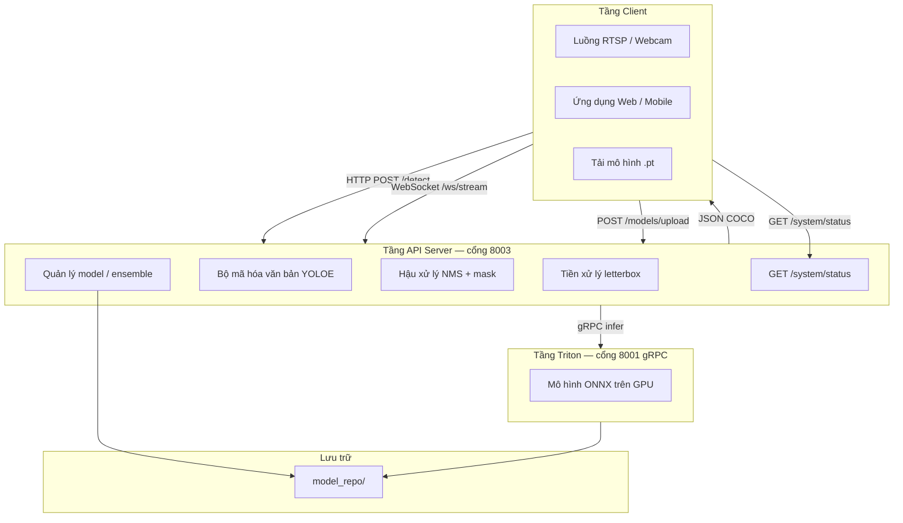
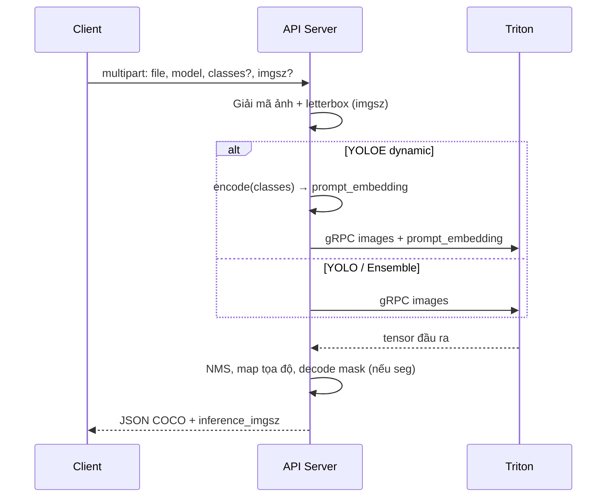
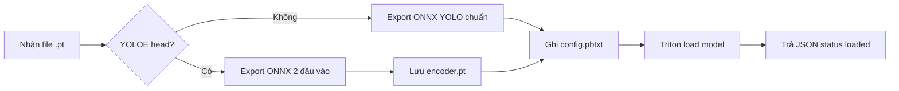

# Hướng dẫn API Server — Nhận diện thị giác (Vision Inference)

Tài liệu tiếng Việt mô tả **toàn bộ** API Server: kiến trúc, luồng xử lý, cấu trúc mã nguồn, từng endpoint, và ví dụ dùng từ phía client.

**Tài liệu tiếng Anh (tham chiếu nhanh):** [API_REFERENCE.md](./API_REFERENCE.md)  
**Swagger tương tác:** `http://<máy-chủ>:8003/docs`  
**Kiến trúc hệ thống:** [../ARCHITECTURE.md](../ARCHITECTURE.md)  
**Sơ đồ Mermaid:** [ARCHITECTURE_DIAGRAMS.md](./ARCHITECTURE_DIAGRAMS.md)

---

## Mục lục

1. [Tổng quan](#1-tổng-quan)
2. [Kiến trúc ba tầng](#2-kiến-trúc-ba-tầng)
3. [Sơ đồ luồng dữ liệu](#3-sơ-đồ-luồng-dữ-liệu)
4. [Cấu trúc thư mục & mã nguồn](#4-cấu-trúc-thư-mục--mã-nguồn)
5. [Các loại mô hình](#5-các-loại-mô-hình)
6. [Tham số chung](#6-tham-số-chung)
7. [Định dạng kết quả phát hiện](#7-định-dạng-kết-quả-phát-hiện)
8. [API chi tiết](#8-api-chi-tiết)
9. [Tải mô hình lên (upload)](#9-tải-mô-hình-lên-upload)
10. [Ensemble — chạy nhiều mô hình song song](#10-ensemble--chạy-nhiều-mô-hình-song-song)
11. [YOLOE — nhắc văn bản động](#11-yoloe--nhắc-văn-bản-động)
12. [Mã lỗi HTTP](#12-mã-lỗi-http)
13. [Triển khai Docker & Tailscale](#13-triển-khai-docker--tailscale)
14. [Ví dụ client đầy đủ](#14-ví-dụ-client-đầy-đủ)

---

## 1. Tổng quan

API Server là lớp trung gian giữa **ứng dụng client** (camera, web, mobile) và **NVIDIA Triton Inference Server** (chạy mô hình ONNX trên GPU).

**Client không gọi Triton trực tiếp.** Mọi thao tác đi qua REST hoặc WebSocket trên cổng **8003**:

| Client làm gì | API xử lý |
|---------------|-----------|
| Gửi ảnh / luồng video | Tiền xử lý ảnh → gọi Triton → hậu xử lý → JSON COCO |
| Tải file `.pt` lên | Chuyển ONNX → ghi `model_repo` → nạp vào Triton |
| Tạo ensemble | Sinh `config.pbtxt` ensemble → nạp Triton |
| Đổi GPU / cấu hình | Sửa `config.pbtxt` → unload/load lại |

**Ưu điểm:** client chỉ cần HTTP; không cần cài CUDA, Ultralytics hay Triton SDK.

---

## 2. Kiến trúc ba tầng

> Sơ đồ đầy đủ: **[ARCHITECTURE_DIAGRAMS.md](./ARCHITECTURE_DIAGRAMS.md)** (13 diagram Mermaid)



| Cổng | Dịch vụ |
|------|---------|
| **8003** | FastAPI — API Server (client kết nối vào đây) |
| **8000** | Triton HTTP — quản trị (load/unload model) |
| **8001** | Triton gRPC — suy luận (API dùng nội bộ) |
| **8002** | Triton metrics |

---

## 3. Sơ đồ luồng dữ liệu

### 3.1. Một ảnh — `POST /detect`



### 3.2. Tải mô hình — `POST /models/upload`



---

## 4. Cấu trúc thư mục & mã nguồn

### 4.1. Docker Compose

```
Docker/
  docker-compose.yaml    # api, triton-remote, tailscale
  .env                   # TS_AUTHKEY (Tailscale)
  docs/
    API_REFERENCE.md     # Tiếng Anh
    HUONG_DAN_API.md     # File này
  scripts/
    test_all_api.sh      # Kiểm thử tự động
    upload_model_list.sh # Upload hàng loạt từ "Model list/"
  Model list/            # File .pt mẫu (fall.pt, best_helmet.pt, …)
  API Server/
    main.py              # Endpoint FastAPI
    preprocess.py        # Letterbox + chuẩn hóa ảnh
    postprocess.py       # NMS, mask, JSON COCO
    triton_client.py     # gRPC Triton
    encoder.py           # YOLOE text → embedding
    model_manager.py     # Upload / xóa / load Triton
    yoloe_export.py      # Export ONNX YOLOE 2 đầu vào
    ensemble_manager.py  # Tạo ensemble
    config_manager.py    # Đọc/ghi config.pbtxt
    upload_validation.py # Kiểm tra lỗi upload
    inference_utils.py   # parse imgsz, tên model
```

### 4.2. Kho mô hình trên đĩa (`model_repo/`)

Mỗi mô hình một thư mục:

```
model_repo/{tên-model}/
  config.pbtxt       # Cấu hình Triton
  labels.json        # Tùy chọn — tên lớp cho YOLO thường
  encoder.pt         # Chỉ YOLOE dynamic
  1/
    model.onnx       # Trọng số ONNX
```

---

## 5. Các loại mô hình

| Loại | Cách nhận biết | Đầu vào Triton | Nhãn / prompt trên `/detect` |
|------|----------------|----------------|-------------------------------|
| **YOLO thường** | 1 input `images` | Ảnh | `labels.json` hoặc tùy chọn `classes` |
| **YOLOE dynamic** | 2 input: `images` + `prompt_embedding` | Ảnh + embedding | **`prompts`** bắt buộc — vd. `person,car` |
| **Ensemble native** | Chỉ YOLO | Ảnh (song song) | Mỗi nhánh dùng `labels.json` |
| **Ensemble hybrid** | Có YOLOE | API điều phối | YOLO: `labels.json`; YOLOE: **`prompts`** |

---

## 6. Tham số chung

### 6.1. `imgsz` — kích thước suy luận

Client có thể đổi độ phân giải **letterbox** (giữ tỷ lệ, pad xám):

| Giá trị | Ý nghĩa |
|---------|---------|
| *(bỏ trống)* | 640×640 |
| `640` | Vuông 640 |
| `1280` | Vuông 1280 |
| `1280,720` | Cao 1280, rộng 720 |

- Giới hạn: 32–4096, làm tròn bội 32.
- Response có `"inference_imgsz": [cao, rộng]`.
- **Upload:** `imgsz` export phải **vuông** (một số). Khi chạy `/detect` có thể dùng hình chữ nhật nếu ONNX hỗ trợ dynamic spatial.

### 6.2. `prompts` vs `classes`

| Tham số | Dùng cho | Mô tả |
|---------|----------|-------|
| **`prompts`** | YOLOE dynamic, hybrid YOLOE | Text prompt, vd. `person,car,helmet` |
| **`classes`** | YOLO thường | Ghi đè tạm `labels.json` trên request này |
| **`labels.json`** | YOLO thường (mặc định) | Đặt một lần qua `PUT /models/{name}/labels` |

Trong ensemble hybrid: chỉ gửi `prompts` cho YOLOE — không gửi `classes` trừ khi muốn ghi đè nhãn tất cả nhánh YOLO.

### 6.3. `conf` / `iou`

- `conf`: ngưỡng tin cậy (mặc định 0.25).
- `iou`: ngưỡng NMS IoU (mặc định 0.45).

---

## 7. Định dạng kết quả phát hiện

API trả JSON kiểu **COCO instance**, không vẽ sẵn lên ảnh — client tự vẽ box/mask.

```json
{
  "image_id": 467728437,
  "image_shape": [1080, 810],
  "inference_imgsz": [640, 640],
  "annotations": [
    {
      "id": 0,
      "category_id": 0,
      "category_name": "person",
      "score": 0.876,
      "bbox": [224.99, 407.02, 115.28, 449.05],
      "area": 51765.48,
      "segmentation": {
        "size": [1080, 810],
        "counts": "Ug\\7d1^3fNeLMm1l0..."
      },
      "iscrowd": 0
    }
  ]
}
```

| Trường | Ý nghĩa |
|--------|---------|
| `bbox` | `[x, y, width, height]` pixel trên **ảnh gốc** |
| `segmentation` | Mask RLE (`pycocotools`); `null` nếu chỉ detect |
| `source_model` | Có khi dùng **ensemble** — tên mô hình con |
| `ensemble` | `true` nếu là kết quả ensemble |

---

## 8. API chi tiết

### 8.1. Hệ thống & giám sát tài nguyên

Client đọc tài nguyên server qua các endpoint sau — **không cần** truy cập Triton trực tiếp.

#### Chọn endpoint nào?

| Nhu cầu client | Endpoint | Tần suất poll |
|----------------|----------|---------------|
| Dashboard CPU/RAM/GPU | **`GET /system/status`** | 5–30 giây |
| Kiểm tra sẵn sàng nhanh | `GET /health` | Khi khởi động |
| Xem GPU + model trên GPU | `GET /gpus` | Trước upload/config |
| Thống kê infer theo model | `GET /system/triton/stats` | 10–60 giây |
| Grafana / Prometheus | `GET /system/metrics` | Theo cấu hình scrape |

> Các metric là **toàn server**, không tách theo từng client/camera.

---

#### `GET /health`

Kiểm tra API sống, Triton sẵn sàng, encoder YOLOE đã load chưa.

```bash
curl http://localhost:8003/health
```

```json
{
  "status": "ok",
  "triton_ready": true,
  "encoder_loaded": true,
  "max_concurrent": 16,
  "max_fps": 10.0,
  "gpu_count": 2
}
```

| Trường | Ý nghĩa |
|--------|---------|
| `triton_ready` | `true` = có thể gọi `/detect` |
| `max_concurrent` | Số gọi Triton đồng thời tối đa (chia sẻ mọi client) |

Không có % CPU/RAM/GPU — dùng `/system/status` cho dashboard.

---

#### `GET /system/status` (khuyến nghị cho dashboard)

Snapshot đầy đủ: API, Triton, CPU, RAM, GPU live, model theo GPU, thống kê infer.

```bash
curl http://localhost:8003/system/status
```

**Cấu trúc response:**

```json
{
  "api": { "status": "ok", "triton_ready": true, "max_concurrent": 16 },
  "triton": { "live": true, "ready": true },
  "host": {
    "cpu": { "percent": 12.5, "count": 31 },
    "memory": { "total_mb": 92450, "used_mb": 53129, "percent": 57.5 }
  },
  "gpus": [
    {
      "index": 0,
      "name": "NVIDIA GeForce GTX 1650",
      "memory_used_mb": 1114,
      "memory_total_mb": 4096,
      "gpu_util_percent": 45,
      "temperature_c": 39
    }
  ],
  "models_by_gpu": { "0": ["person", "fire"], "1": ["yoloe-11l-seg"] },
  "triton_metrics_summary": {
    "inference_success_total": 24997,
    "models": { "person": { "success": 5396, "failure": 2 } }
  }
}
```

**Trường quan trọng cho UI:**

| Đường dẫn | Hiển thị |
|-----------|----------|
| `host.cpu.percent` | % CPU |
| `host.memory.percent` | % RAM |
| `gpus[].gpu_util_percent` | % GPU |
| `gpus[].memory_used_mb` / `memory_total_mb` | VRAM dùng / tổng |
| `models_by_gpu` | Model nào trên GPU nào |

**Ví dụ Python:**

```python
import requests
s = requests.get("http://triton-api:8003/system/status").json()
print(f"CPU {s['host']['cpu']['percent']}%  RAM {s['host']['memory']['percent']}%")
for g in s["gpus"]:
    print(f"GPU{g['index']}: {g['gpu_util_percent']}%  VRAM {g['memory_used_mb']}/{g['memory_total_mb']} MB")
```

Lỗi **503** nếu Triton metrics không truy cập được.

---

#### `GET /system/triton/stats`

Proxy thống kê infer chi tiết từ Triton (`/v2/models/stats`): số lần infer, queue time, compute latency (ns) theo từng model.

```bash
curl http://localhost:8003/system/triton/stats
```

---

#### `GET /system/metrics`

Raw Prometheus text từ Triton cổng 8002 — dùng cho Grafana, không dùng cho app client thông thường.

```bash
curl http://localhost:8003/system/metrics
```

---

#### `GET /gpus?refresh=false`

Liệt kê GPU và mô hình đang gán trên từng GPU — dùng trước khi `upload` với `gpus=0` hoặc `gpus=1`.

```bash
curl http://localhost:8003/gpus
curl "http://localhost:8003/gpus?refresh=true"
```

```json
{
  "gpus": [{ "index": 0, "name": "NVIDIA ...", "memory_total_mb": 4096 }],
  "models_by_gpu": { "0": ["person", "fire"], "1": ["fall"] },
  "default_gpu": 0
}
```

Không có % utilization — dùng `/system/status` cho số live.

---

### 8.2. Suy luận

#### `POST /detect`

**Content-Type:** `multipart/form-data`

| Trường | Bắt buộc | Mô tả |
|--------|----------|--------|
| `file` | Có | Ảnh JPEG/PNG |
| `model` | Có | Tên model trong Triton |
| `prompts` | YOLOE: có | Text prompt YOLOE, vd. `person,car` |
| `classes` | Không | Chỉ YOLO thường — ghi đè `labels.json` |
| `imgsz` | Không | Kích thước letterbox |
| `conf` | Không | Ngưỡng tin cậy |
| `iou` | Không | NMS |

```bash
# YOLO thường
curl -X POST http://localhost:8003/detect \
  -F "file=@anh.jpg" \
  -F "model=person" \
  -F "conf=0.25"

# Độ phân giải tùy chỉnh
curl -X POST http://localhost:8003/detect \
  -F "file=@anh.jpg" \
  -F "model=person" \
  -F "imgsz=1280"

# YOLOE — bắt buộc prompts (không dùng classes)
curl -X POST http://localhost:8003/detect \
  -F "file=@anh.jpg" \
  -F "model=yoloe-v8s-seg" \
  -F "prompts=person,car" \
  -F "imgsz=640"
```

#### `WebSocket /ws/stream`

Luồng video: client gửi **byte JPEG** liên tục; server trả JSON mỗi frame được xử lý.

**Query:** `model`, `prompts?` (YOLOE), `classes?` (YOLO), `imgsz?`, `conf`, `iou`, `fps`

```
ws://localhost:8003/ws/stream?model=person&fps=10&imgsz=640
```

- Frame vượt `fps` → **bỏ qua** (không có phản hồi).
- YOLOE: bắt buộc `prompts` trên query.

---

### 8.3. Quản lý mô hình

#### `GET /models`

Danh sách model Triton, **tách sẵn**:

| Trường | Ý nghĩa |
|--------|---------|
| `models` | Tất cả (tương thích cũ) |
| `single_models` | YOLO / YOLOE ONNX — dùng `/detect` trực tiếp |
| `ensemble_models` | Pipeline ensemble — `platform: ensemble` |

Mỗi phần tử có `kind` (`single` | `ensemble`) và `platform` (nếu có trong config).

#### `DELETE /models/{name}`

Gỡ khỏi Triton + xóa thư mục. **404** nếu không tồn tại.

#### `PUT /models/{name}/labels`

Ghi `labels.json` — map `category_id` → tên lớp.

```bash
curl -X PUT http://localhost:8003/models/person/labels \
  -H "Content-Type: application/json" \
  -d '{"labels": ["person"]}'
```

#### `GET /models/{name}/labels`

#### `GET /PUT /models/{name}/config`

Đọc / cập nhật `config.pbtxt` (batching, instance_group, …) và reload.

#### `GET /PUT /models/{name}/instances`

Chỉ khối `instance_group` — chọn GPU.

```bash
curl -X PUT http://localhost:8003/models/person/instances \
  -H "Content-Type: application/json" \
  -d '[{"count": 1, "kind": "KIND_GPU", "gpus": [0]}]'
```

---

## 9. Tải mô hình lên (upload)

### `POST /models/upload`

| Trường | Bắt buộc | Mô tả |
|--------|----------|--------|
| `file` | Có | File `.pt` / `.pth` |
| `name` | Không | Tên Triton; **mặc định = tên file** (`fall.pt` → `fall`) |
| `overwrite` | Không | `true` ghi đè model đã có |
| `gpus` | Không | `0`, `1`, `0,1` |
| `imgsz` | Không | Kích thước export (vuông, mặc định 640) |
| `dynamic` | Không | ONNX dynamic (mặc định true) |
| `yoloe_dynamic` | Không | Export YOLOE 2 đầu vào (mặc định true) |
| `config` | Không | JSON override config |

```bash
# Tự đặt tên từ file
curl -X POST http://localhost:8003/models/upload \
  -F "file=@Docker/Model list/fall.pt" \
  -F "overwrite=true" \
  -F "gpus=1"

# Đặt tên rõ ràng
curl -X POST http://localhost:8003/models/upload \
  -F "file=@yoloe-v8s-seg.pt" \
  -F "name=my-yoloe" \
  -F "gpus=1"
```

**Upload hàng loạt** từ thư mục `Model list/`:

```bash
cd Docker
OVERWRITE=true ./scripts/upload_model_list.sh
```

**Phản hồi thành công:**

```json
{
  "status": "loaded",
  "model": "fall",
  "type": "yolo-detect",
  "export_imgsz": 640,
  "config": { "instance_group": [{ "gpus": [1] }] }
}
```

---

## 10. Ensemble — chạy nhiều mô hình song song

Ensemble chạy **nhiều model trên cùng một ảnh** (song song trong Triton), gộp kết quả.

### Tạo ensemble

```bash
curl -X POST http://localhost:8003/ensemble/create \
  -H "Content-Type: application/json" \
  -d '{
    "name": "an-toan-cong-truong",
    "steps": [
      { "model": "person", "version": -1 },
      { "model": "fall", "version": -1 },
      { "model": "helmet", "version": -1 }
    ]
  }'
```

Các model trong `steps` phải **đã load** trong Triton.

### Detect với ensemble

```bash
curl -X POST http://localhost:8003/detect \
  -F "file=@anh.jpg" \
  -F "model=an-toan-cong-truong" \
  -F "conf=0.25"
```

Mỗi annotation có thêm `source_model`.

### Xóa ensemble

```bash
curl -X DELETE http://localhost:8003/ensemble/an-toan-cong-truong
```

---

## 11. YOLOE — nhắc văn bản động

YOLOE cho phép client **đổi lớp bằng text** mỗi request, không cần train lại.

**Luồng:**

1. Upload `yoloe-*.pt` → API export ONNX **không fuse** (2 input).
2. Lưu `encoder.pt` cùng thư mục model.
3. Mỗi `/detect`: API gọi `get_text_pe(["person","car"])` → tensor `[1, N, 512]` → Triton.

**Lưu ý:**

- `prompts` **bắt buộc** trên mọi request YOLOE dynamic (không dùng `classes`).
- `labels.json` **không** dùng cho YOLOE — tên lớp = đúng chuỗi trong `prompts`.
- Ensemble hybrid: `prompts` chỉ cho bước YOLOE; YOLO thường giữ `labels.json`.
- Segmentation: mask decode đã chỉnh letterbox (khớp Ultralytics trên cùng tensor Triton).

---

## 12. Mã lỗi HTTP

| Mã | Tình huống |
|----|------------|
| **400** | Ảnh rỗng, `imgsz` sai, tên model không hợp lệ, file không phải `.pt` |
| **404** | Model / labels / config không tồn tại |
| **409** | Upload trùng tên (`overwrite=false`) hoặc ensemble đã tồn tại |
| **422** | Export ONNX / YOLOE thất bại |
| **502** | Triton không load được model |
| **503** | Triton chưa sẵn sàng; encoder YOLOE thiếu |
| **500** | Lỗi nội bộ không mong đợi |

Body lỗi chuẩn FastAPI:

```json
{ "detail": "Model 'fall' already exists in the repository. Delete it first or pass overwrite=true." }
```

---

## 13. Triển khai Docker & Tailscale

### Khởi động

```bash
cd Docker
# Đặt TS_AUTHKEY trong .env nếu dùng Tailscale
docker compose up -d triton-remote api api-tailscale
```

### Biến môi trường API

| Biến | Mặc định | Ý nghĩa |
|------|----------|---------|
| `TRITON_GRPC_URL` | `triton-remote:8001` | gRPC Triton |
| `MODEL_REPO_PATH` | `/model_repo` | Thư mục model (volume) |
| `YOLOE_WEIGHTS` | `/weights/yoloe-v8s-seg.pt` | Encoder dự phòng |
| `MAX_CONCURRENT` | `32` | Số request Triton đồng thời |
| `MAX_FPS` | `10` | FPS mặc định WebSocket |

### Tailscale

| Hostname | Cổng | Dịch vụ |
|----------|------|---------|
| `triton-api` | 8003 | API (client dùng) |
| `triton-server` | 8000–8002 | Triton (quản trị / debug) |

Từ máy trong mạng Tailscale:

```bash
curl http://triton-api:8003/health
```

---

## 14. Ví dụ client đầy đủ

### Python — một ảnh

```python
import requests

url = "http://localhost:8003/detect"
files = {"file": open("anh.jpg", "rb")}
data = {
    "model": "person",
    "conf": "0.25",
    "imgsz": "1280",
}
r = requests.post(url, files=files, data=data)
r.raise_for_status()
ket_qua = r.json()
for ann in ket_qua["annotations"]:
    print(ann["category_name"], ann["score"], ann["bbox"])
```

### Python — YOLOE

```python
data = {
    "model": "yoloe-v8s-seg",
    "prompts": "person,car,xe bus",
    "conf": "0.25",
}
```

### JavaScript — fetch

```javascript
const form = new FormData();
form.append("file", fileInput.files[0]);
form.append("model", "person");
form.append("imgsz", "640");

const res = await fetch("http://localhost:8003/detect", {
  method: "POST",
  body: form,
});
const data = await res.json();
```

### Kiểm thử tự động

```bash
./Docker/scripts/test_all_api.sh
```

---

## Phụ lục: Checklist tích hợp client

- [ ] Gọi `GET /health` — `triton_ready: true`
- [ ] `GET /models` — model cần dùng ở trạng thái `READY`
- [ ] `GET /system/status` — poll CPU/RAM/GPU cho dashboard (tuỳ chọn)
- [ ] YOLOE: luôn gửi `prompts` (không gửi `classes` khi chạy kèm YOLO thường)
- [ ] `model` + `file` là **form field**, không chỉ query string (trừ WebSocket)
- [ ] Vẽ bbox: dùng `bbox` [x,y,w,h] trên `image_shape`
- [ ] Upload: dùng `overwrite=true` nếu ghi đè; bỏ `name` để lấy tên từ file
- [ ] Lỗi 409 → xóa model cũ hoặc `overwrite=true`

---

*Tài liệu đồng bộ với API phiên bản 1.1.0. Cập nhật Swagger tại `/docs` khi triển khai.*
